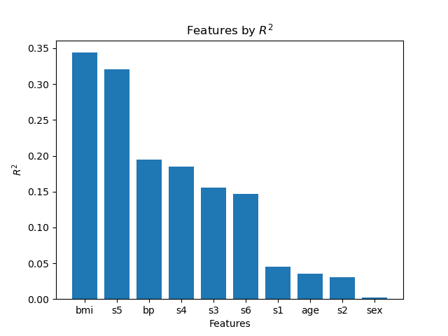
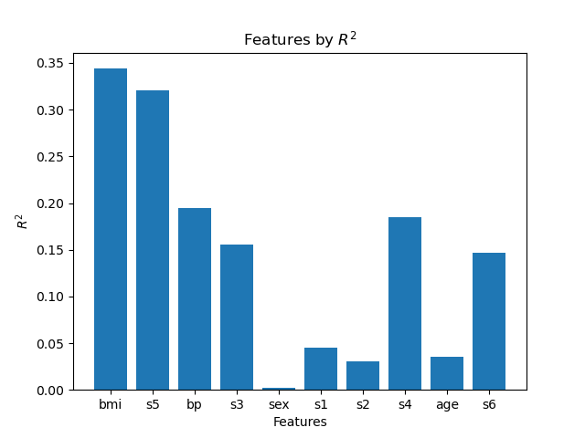
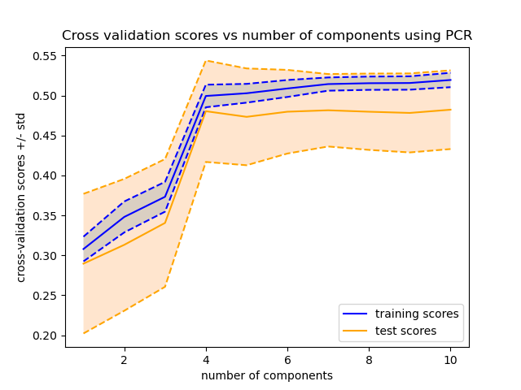
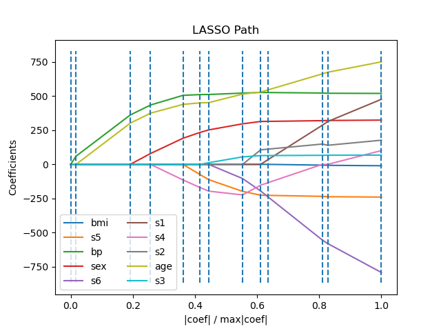

# hw-diabetes

## Goals

* Model-selection techniques using the diabetes dataset
* Comparison of feature ranking with $R^2$, forward selection and Lasso
* PCR (principal component regression) with cross validation to assess feature dimension

## Assignment

Use the diabetes dataset from [sklearn.datasets.load_diabetes](https://scikit-learn.org/stable/modules/generated/sklearn.datasets.load_diabetes.html) to answer the questions below.

## Question 1

Rank the features according to their squared correlation with the target. 
Note that squared correlation is the same as $R^2$ for univariate regression. 
Visualize the ordered scores with a bar chart.

Ranking the features from highest squared correlation gives the following order:
bmi, s5, bp, s4, s3, s6, s1, age, s2, sex

Here are the features ranked by $R^2$ values:

## Question 2

Rank the features according to the order that they're added in the [forward sequential feature selection](https://scikit-learn.org/stable/modules/generated/sklearn.feature_selection.SequentialFeatureSelector.html) algorithm. Use this ranking to reorder the bar chart in question 1.

The Sequential Feature Selector selects features in this order:
bmi, s5, bp, s3, sex, s1, s2, s4, age, s6

Here is the reordered bar chart, showing features as ordered by the Sequential Feature Selector:

## Question 3

Compare the bar charts in Questions 1 & 2.
Briefly discuss differences between the two charts and possible causes.
Add a figure to prove your point.

These two charts are different possibly because of the differing covariance between the features. For instance, sex has the smallest $R^2$ with the target, but it appears that sex acts as the best fifth feature for a five-input model (where the other features are bmi, s5, bp and s3), better than all the remaining features.

## Question 4

Plot cross-validation scores versus the number of components used in Principal Component Regression (PCR). 
(Recall the [PCR vs PLS](https://scikit-learn.org/stable/auto_examples/cross_decomposition/plot_pcr_vs_pls.html)
demo mentioned in class.)
Include both training and test scores.
Comment on the dimensionality of the dataset and the degree of overfitting.
Hint: The [CV-diabetes demo](https://scikit-learn.org/stable/auto_examples/exercises/plot_cv_diabetes.html),
which uses cross-validation to determine the best `alpha`, may be helpful in answering this question.

The error seems to decrease as the number of components used increases. Therefore, the degree of overfitting appear to be low.

Here is a figure showing cross-validation scores vs number of components.

## Question 5

The [lasso lars demo](https://scikit-learn.org/stable/auto_examples/linear_model/plot_lasso_lars.html) computes and plots the coefficients with lasso. Add a legend to the plot so that you can relate colors to feature names. Briefly compare the lasso ordering to your answers above.

Here is the plot of lasso scores

It ranks the features (from best score to worst) in the following order:
bmi, s5, bp, sex, s6, s1, s4, s2, age, s3.

It seems like, as in all the other rankings, bmi, s5 and bp are the features with the best scores. However, lasso ranks sex much higher thanindividual $R^2$ ranks sex, and lasso also ranks s6 much higher than the sequential feature selector ranks s6.
